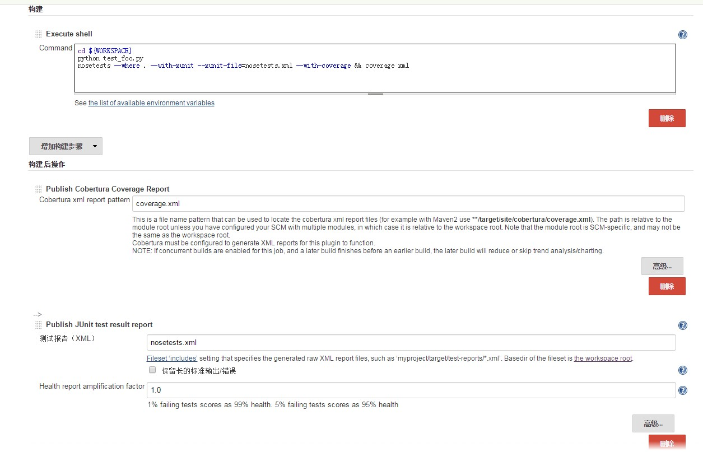

```shell
pip install nosetest coverage unittest-xml-reporting
```

foo.py:
```python
# -*- coding: UTF-8 -*-
def divide(num1,num2):
  return num1/num2
```
test_foo.py:
```python
# -*- coding: UTF-8 -*-
import unittest
import foo

class SimpleTest(unittest.TestCase):
  def test1(self):
    self.assertEqual(foo.divide(2,2),1)
  
  def test2(self):
    self.assertEqual(foo.divide(0,2),0)

if __name__=="__main__":
  unittest.main()
```
```shell
python test_foo.py
nosetests --where . --with-xunit --xunit-file=nosetests.xml --with-coverage && coverage xml
```

nosetest插件:
--pdb 出错时自动调用pdb调试



